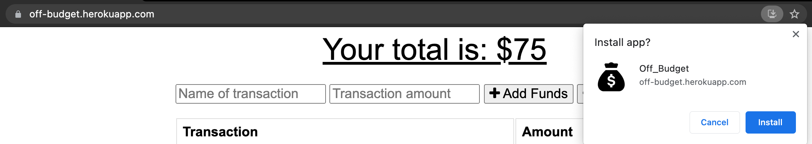

# off_budget

## Description

A budget tracking website that works even when the user has no internet connection. Best of all the app can be installed directly on your mobile device or desktop.

Checkout [Off-Budget!](https://off-budget.herokuapp.com/)

## Table of Contents

- [Technologies Used](#technologies-used)
- [Usage](#usage)
- [License](#license)
- [Questions](#questions)

## Technologies Used

- JavaScript
- mongoose
- Express.js
- mongoDB
- Heroku
- PWA
- morgan
- compression
- AtlasDB

## Usage

This easy to use budget tracker allows the user to enter the name of the transaction, the amount of the transaction, and either add funds or subract funds, while all being visually displayed in a chart.

No need to worry about internet connections, as the app will still allow the user to log transactions even when offline. Once an internet connection is established the transaction will post automatically!

Finally feel free to download the application on to your mobile device or desktop/laptop, so you never have to worry about keeping track of your budget while on the move!

Here's a quick tutorial on installing the application to your deskptop/laptop using Google Chrome!

## License

MIT License

Copyright (c) 2021 DiSantoz

Permission is hereby granted, free of charge, to any person obtaining a copy
of this software and associated documentation files (the "Software"), to deal
in the Software without restriction, including without limitation the rights
to use, copy, modify, merge, publish, distribute, sublicense, and/or sell
copies of the Software, and to permit persons to whom the Software is
furnished to do so, subject to the following conditions:

The above copyright notice and this permission notice shall be included in all
copies or substantial portions of the Software.

THE SOFTWARE IS PROVIDED "AS IS", WITHOUT WARRANTY OF ANY KIND, EXPRESS OR
IMPLIED, INCLUDING BUT NOT LIMITED TO THE WARRANTIES OF MERCHANTABILITY,
FITNESS FOR A PARTICULAR PURPOSE AND NONINFRINGEMENT. IN NO EVENT SHALL THE
AUTHORS OR COPYRIGHT HOLDERS BE LIABLE FOR ANY CLAIM, DAMAGES OR OTHER
LIABILITY, WHETHER IN AN ACTION OF CONTRACT, TORT OR OTHERWISE, ARISING FROM,
OUT OF OR IN CONNECTION WITH THE SOFTWARE OR THE USE OR OTHER DEALINGS IN THE
SOFTWARE.

## Questions

Hi my name is [DiSantoz](https://github.com/DiSantoz) the developer behind off-budget !

If you have any questions about the usage of this project or any suggestions on how to better this project please feel free to contact me at:

dferreira91@outlook.com
